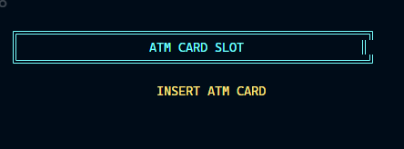
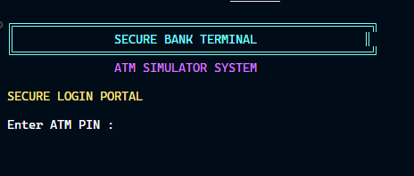
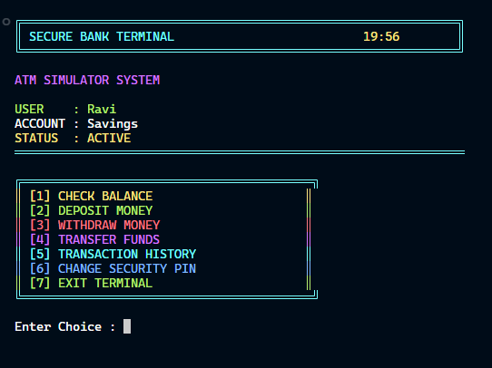
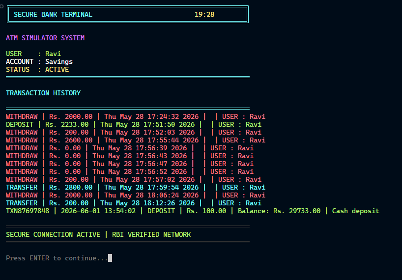
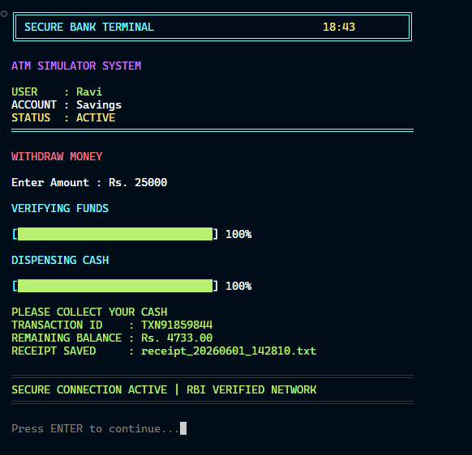
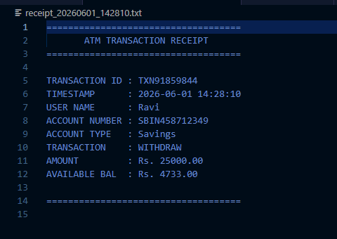

<div align="center">

```
 █████╗ ████████╗███╗   ███╗    ███████╗██╗███╗   ███╗██╗   ██╗██╗      █████╗ ████████╗ ██████╗ ██████╗ 
██╔══██╗╚══██╔══╝████╗ ████║    ██╔════╝██║████╗ ████║██║   ██║██║     ██╔══██╗╚══██╔══╝██╔═══██╗██╔══██╗
███████║   ██║   ██╔████╔██║    ███████╗██║██╔████╔██║██║   ██║██║     ███████║   ██║   ██║   ██║██████╔╝
██╔══██║   ██║   ██║╚██╔╝██║    ╚════██║██║██║╚██╔╝██║██║   ██║██║     ██╔══██║   ██║   ██║   ██║██╔══██╗
██║  ██║   ██║   ██║ ╚═╝ ██║    ███████║██║██║ ╚═╝ ██║╚██████╔╝███████╗██║  ██║   ██║   ╚██████╔╝██║  ██║
╚═╝  ╚═╝   ╚═╝   ╚═╝     ╚═╝    ╚══════╝╚═╝╚═╝     ╚═╝ ╚═════╝ ╚══════╝╚═╝  ╚═╝   ╚═╝    ╚═════╝ ╚═╝  ╚═╝
```

# 🏧 ATM Simulator in C

### Advanced Terminal-Based Banking ATM Simulator

[](https://en.wikipedia.org/wiki/C_(programming_language))
[](https://www.microsoft.com/windows)
[](https://gcc.gnu.org/)
[](LICENSE)
[]()

</div>

---

## 📌 Table of Contents

- [Overview](#-overview)
- [Features](#-features)
- [Technical Concepts Used](#-technical-concepts-used)
- [Architecture Overview](#-architecture-overview)
- [System Workflow](#-system-workflow)
- [Storage System](#-storage-system)
- [Transaction Logging](#-transaction-logging)
- [Receipt Generation](#-receipt-generation)
- [Session Timer System](#-session-timer-system)
- [Project Structure](#-project-structure)
- [Compilation Instructions](#-compilation-instructions)
- [Usage Instructions](#-usage-instructions)
- [Sample Accounts](#-sample-accounts)
- [Screenshots](#-screenshots)
- [Project Highlights](#-project-highlights)
- [Learning Outcomes](#-learning-outcomes)
- [Challenges Faced](#-challenges-faced)
- [Future Improvements](#-future-improvements)
- [Skills Demonstrated](#-skills-demonstrated)
- [Resume Highlights](#-resume-highlights)
- [About the Developer](#-about-the-developer)
- [Contributing](#-contributing)
- [License](#-license)

---
## 📊 Project Statistics

- Language: C
- Lines of Code: ~900+
- Storage Method: Text Files
- Platform: Windows
- Compiler Support: GCC, MinGW, MSYS2

---


## 🔍 Overview

This project is an advanced terminal-based ATM Simulator developed in C. It demonstrates authentication, file handling, persistent storage, transaction management, session management, and console-based user interface design using the Windows API.

The simulator covers the complete ATM interaction lifecycle — from animated startup and card insertion, through authenticated banking operations, to receipt generation and auto-logout on session timeout. All account and transaction data is persisted across restarts using plain text files, with no external libraries or databases required.

---


## ✨ Features

### 🔐 Authentication & Security
- `🔑` **PIN-Based Authentication** — 4-digit PIN verification per account
- `🛡️` **Safe Input Validation** — Handles invalid inputs and edge cases
- `🔄` **Change PIN** — Users can update their PIN during an active session
- `👥` **Multi-User Account Support** — Multiple independent user accounts stored in `accounts.txt`

### 💰 Banking Operations
- `💳` **Balance Inquiry** — Display of current account balance
- `⬆️` **Deposit Money** — Add funds with instant balance update and logging
- `⬇️` **Withdraw Money** — Withdraw with sufficient-funds validation and logging
- `↔️` **Transfer Funds** — Inter-account fund transfer with receiver validation
- `✅` **Receiver Validation** — Verifies destination account exists before executing transfers

### 📋 Logging & Records
- `🧾` **Transaction History** — View all past transactions for the current account
- `🆔` **Unique Transaction IDs — Randomly generated transaction identifiers are included in transaction records and receipts.
- `🖨️` **Receipt Generation** — Receipts saved as timestamped `.txt` files in the project root
- `🕐` **Timestamps on All Records** — Date and time recorded for every transaction

### 🖥️ Interface & UX
- `🎬` **Boot Screen Animation** — Startup sequence with ASCII art
- `💳` **Card Insert Animation** — Simulated card insertion before login
- `📊` **Loading Bars** — Animated progress indicators for operations
- `🌈` **Colored Terminal Interface** — Windows Console API color-coded UI
- `⏱️` **Real-Time Session Timer** — Live `19:59` countdown displayed during session
- `⏰` **Automatic Session Expiration** — Auto-logout and return to welcome screen on timeout

### 💾 Data Persistence
- `📁` **File-Based Storage** — Account and transaction data stored in plain text files
- `🔒` **Persistent Account Storage** — Data survives restarts via `accounts.txt`
- `📝` **Transaction Log** — All transactions appended to `transactions.txt`

---

## 🧠 Technical Concepts Used

This project applies several important computer science concepts:

| Concept | Application in Project |
|---|---|
| **Structures** | `struct Account` and `struct Transaction` to model data |
| **Arrays** | Array of `Account` structs loaded from file at startup |
| **File Handling** | `fopen`, `fclose`, `fprintf`, `fscanf` for persistent read/write |
| **Dynamic Data Management** | In-memory account array updated and written back on each operation |
| **String Manipulation** | Account names, transaction types, timestamps handled as strings |
| **Input Validation** | Range checks, type validation, and overflow prevention on all inputs |
| **Time and Date Functions** | `time()`, `localtime()`, `strftime()` from `<time.h>` for timestamps |
| **State Machines** | Application flow managed across states: boot → auth → session → timeout |
| **Console Graphics** | Windows Console API for color, cursor positioning, and animations |
| **Modular Programming** | Logical separation into focused functions within a single-file architecture |

---

## 🏗️ Architecture Overview

```
┌─────────────────────────────────────────────────────────────┐
│                     ATM Simulator (main.c)                  │
├─────────────────────────────────────────────────────────────┤
│                                                             │
│   ┌──────────────┐    ┌──────────────┐    ┌─────────────┐  │
│   │  UI Layer    │    │ Logic Layer  │    │  Data Layer │  │
│   │              │    │              │    │             │  │
│   │ Boot Screen  │───▶│ Auth System  │───▶│ accounts.txt│  │
│   │ Animations   │    │ Banking Ops  │    │             │  │
│   │ Color Output │    │ Validations  │───▶│transactions │  │
│   │ Session Timer│    │ Session Mgmt │    │    .txt     │  │
│   └──────────────┘    └──────────────┘    └─────────────┘  │
│                                                             │
│   ┌────────────────────────────────────────────────────┐   │
│   │               Windows Console API                  │   │
│   │  SetConsoleTextAttribute · gotoxy · system("cls")  │   │
│   └────────────────────────────────────────────────────┘   │
│                                                             │
│   ┌────────────────────────────────────────────────────┐   │
│   │                  Data Structures                    │   │
│   │        struct Account  ·  struct Transaction        │   │
│   └────────────────────────────────────────────────────┘   │
└─────────────────────────────────────────────────────────────┘
```

### Core Components

| Component | Responsibility |
|---|---|
| **Boot & Animation Engine** | Startup screens, loading bars, card insert animation |
| **Authentication Module** | PIN verification, session initialization, PIN change |
| **Banking Operations** | Deposit, withdraw, transfer logic with validation |
| **Session Timer** | Real-time 19:59 countdown, auto-expiry, timeout handling |
| **File I/O Manager** | Read/write to `accounts.txt` and `transactions.txt` |
| **Receipt Generator** | Creates timestamped receipt `.txt` files in the project root |
| **Console UI Engine** | Color output, cursor positioning, screen clearing |

---

## ⚙️ System Workflow

The ATM follows a state machine from startup to session end:

```
┌──────────────────────────────────────────────────────────────┐
│                     SYSTEM LIFECYCLE                         │
└──────────────────────────────────────────────────────────────┘

  [1] BOOT SEQUENCE
      └─▶ ASCII splash screen + loading bar animation

  [2] WELCOME SCREEN
      └─▶ "Insert Card" prompt displayed

  [3] CARD INSERT ANIMATION
      └─▶ Simulated card read animation plays

  [4] PIN AUTHENTICATION
      ├─▶ User enters 4-digit PIN
      ├─▶ PIN verified against accounts.txt
      └─▶ [FAIL] Return to card screen after failed attempts

  [5] SESSION START
      └─▶ 19:59 countdown timer begins in real-time

  [6] MAIN MENU
      ├─▶ Balance Inquiry
      ├─▶ Deposit
      ├─▶ Withdraw
      ├─▶ Transfer Funds
      ├─▶ Transaction History
      ├─▶ Change PIN
      └─▶ Logout

  [7] BANKING OPERATION
      ├─▶ Input validated
      ├─▶ Balance and file updated
      ├─▶ Transaction logged to transactions.txt
      ├─▶ Unique transaction ID assigned
      └─▶ Receipt .txt file generated in project root

  [8] SESSION END (Logout OR Timeout)
      └─▶ Return to Welcome Screen
```

---

## 💾 Storage System

Account data is persisted in `accounts.txt` using a structured plain-text format. Each line represents one account record.

### Account Record Format (`accounts.txt`)

```
<AccountNumber> <PIN> <HolderName> <Balance>
```

**Example:**
```
Ram Mohan|1976|Savings|HDFC982134567|1067234.00
Sunitha|1982|Savings|ICIC764512389|900543.00
Jemima|1108|Current|AXIS983456721|2177601.00
```

```
## 👤 Demo Accounts

Refer to accounts.txt for the latest demo credentials.
```

### Data Structure (In-Memory)

```c
struct Account {
    int    accountNumber;
    int    pin;
    char   holderName[50];
    float  balance;
};
```

All accounts are loaded into an array of `Account` structs at startup. After any write operation (deposit, withdraw, transfer, PIN change), the full array is written back to `accounts.txt` to maintain persistence.

---

## 📝 Transaction Logging

Every financial operation is appended to `transactions.txt` with a full record.

### Transaction Record Format (`transactions.txt`)

```
<TransactionID> <AccountNumber> <Type> <Amount> <Balance_After> <Timestamp>
```

### Transaction Data Structure

```c
struct Transaction {
    char  transactionID[12];
    int   accountNumber;
    char  type[20];
    float amount;
    float balanceAfter;
    char  timestamp[25];
};
```

Transaction IDs are generated at runtime and stored with transaction records and receipts for identification purposes to maintain sort order and uniqueness across sessions.

---

## 🧾 Receipt Generation

After every successful transaction, the system generates a receipt saved as a `.txt` file in the **project root directory**.

### Receipt Filename Format

```
receipt_20260601_142810.txt
```

**Example filename:**
```
receipt_1001_20240115_143547.txt
```

### Sample Receipt

```
╔══════════════════════════════════════╗
║         ATM TRANSACTION RECEIPT      ║
╠══════════════════════════════════════╣
║  Date     : 2024-01-15               ║
║  Time     : 14:35:47                 ║
║  Txn ID   : TXN00002                 ║
╠══════════════════════════════════════╣
║  Account  : 1001                     ║
║  Name     : Ravi Varma               ║
║  Type     : WITHDRAWAL               ║
║  Amount   : Rs. 2000.00              ║
║  Balance  : Rs. 28000.00             ║
╠══════════════════════════════════════╣
║     Thank you for using ATM          ║
╚══════════════════════════════════════╝
```

> Receipt files are written to the same directory as `main.c`, `accounts.txt`, and `transactions.txt`. There is no separate receipts folder.

---

## ⏱️ Session Timer System

The session timer displays a live `19:59` countdown on-screen and triggers automatic logout when it reaches zero.

### How It Works

```
┌─────────────────────────────────────────┐
│           SESSION TIMER FLOW            │
├─────────────────────────────────────────┤
│                                         │
│  Session Start                          │
│       │                                 │
│       ▼                                 │
│  remainingTime = 1199  (19 min 59 sec)  │
│       │                                 │
│       ▼                                 │
│  ┌──────────────────────┐               │
│  │  Loop every 1 second │               │
│  │  remainingTime--     │               │
│  │  Update display      │               │
│  └──────────┬───────────┘               │
│             │                           │
│      remainingTime == 0?                │
│             │                           │
│    YES ─────┘                           │
│       │                                 │
│       ▼                                 │
│  Display "Session Expired" message      │
│  Clear session data                     │
│  Return to Welcome Screen               │
│                                         │
└─────────────────────────────────────────┘
```

The timer uses `time()` from `<time.h>` to track elapsed seconds. The on-screen display is updated every second using cursor repositioning via the Windows Console API — without a full screen redraw — to prevent flickering. When the countdown reaches zero, the session is terminated and the program returns to the welcome screen automatically.

---

## 📁 Project Structure

```
ATM-Simulator-C/
│
├── assets/
│   ├── card-insert-animation.png
│   ├── login-screen.png
│   ├── main-menu.png
│   ├── receipt-example.png
│   ├── transaction-history.png
│   └── withdrawal-success.png
│
├── .gitignore
├── accounts.txt                           # Persistent account database
├── main.c                                 # Complete source code
├── README.md                              # Project documentation
└── transactions.txt                       # Cumulative transaction log
```

> Receipt files (`receipt_<YYYYMMDD_HHMMSS>.txt`) are generated at runtime in the project root directory alongside `accounts.txt` and `transactions.txt`. They are excluded from version control via `.gitignore`.

---

## 🔧 Compilation Instructions

### Prerequisites

- Windows OS (required for Windows Console API)
- Any C99-compatible compiler: GCC, MinGW, or MSYS2

---

### Option 1 — GCC (Windows)

```bash
gcc main.c -o atm_simulator.exe
./atm_simulator.exe
```

---

### Option 2 — MinGW (Recommended for Windows)

**Step 1:** Install MinGW from [https://www.mingw-w64.org/](https://www.mingw-w64.org/)

**Step 2:** Add MinGW `bin/` to your system PATH

**Step 3:** Compile and run

```bash
gcc main.c -o atm_simulator.exe -lwinmm
atm_simulator.exe
```

---

### Option 3 — MSYS2

**Step 1:** Install MSYS2 from [https://www.msys2.org/](https://www.msys2.org/)

**Step 2:** Open the MSYS2 MinGW64 terminal and install the toolchain

```bash
pacman -S mingw-w64-x86_64-gcc
```

**Step 3:** Navigate to the project directory and compile

```bash
cd /path/to/ATM-Simulator-C
gcc main.c -o atm_simulator.exe -lwinmm
./atm_simulator.exe
```

---

### Option 4 — Dev-C++ / Code::Blocks (IDE)

1. Open the IDE and create a new **Empty Project** (C language)
2. Add `main.c` to the project
3. Build & Run (`F9` in Dev-C++, `F9` in Code::Blocks)

> ⚠️ **Important:** This project uses `<windows.h>` and Windows Console APIs. It is **not cross-platform**. Compilation on Linux/macOS without modification will fail.

---

## 🚀 Usage Instructions

### First Run

1. Compile and run the executable
2. The boot animation and welcome screen will appear
3. Use one of the sample accounts below to log in
4. The `19:59` session timer starts immediately after successful login

### Navigation

```
Main Menu Options:
─────────────────
[1] Balance Inquiry      → View current balance
[2] Deposit              → Enter amount to deposit
[3] Withdraw             → Enter amount to withdraw
[4] Transfer Funds       → Enter receiver account + amount
[5] Transaction History  → View all past transactions
[6] Change PIN           → Enter old PIN → Enter new PIN (×2)
[0] Logout               → End session, return to welcome screen
```

### Notes

- Session auto-expires after **19 minutes 59 seconds**
- Each successful transaction generates a `receipt_*.txt` file in the project root
- Fund transfers require the receiver's account number to exist in `accounts.txt`
- PIN changes take effect immediately and are written back to file

---

## 👤 Demo Accounts

Demo account credentials are maintained in `accounts.txt`.

Please refer to that file for the latest sample accounts included with the project.
---

## 📸 Screenshots

### 1. Card Insert Animation



> The welcome screen prompts the user to insert their card. A simulated card-read animation plays before the PIN entry screen is displayed.

---

### 2. Login Screen



> The PIN authentication screen. The user enters their 4-digit PIN, which is verified against the account records stored in `accounts.txt`. Failed attempts return the user to the card screen.

---

### 3. Main Menu



> The main banking menu displayed after successful login. The real-time `19:59` session countdown is visible on-screen. All banking operations are accessible from this screen.

---

### 4. Transaction History



> Displays all past transactions for the currently logged-in account, read from `transactions.txt`. Each entry shows the transaction ID, type, amount, resulting balance, and timestamp.

---

### 5. Withdrawal Transaction



> Confirmation screen shown after a successful withdrawal. The updated balance is displayed and a receipt `.txt` file is automatically generated in the project root directory.

---

### 6. Receipt Example



> A sample receipt file generated after a transaction. Receipt files are named in the format `receipt_20260601_142810.txt` and saved to the project root directory.

---

## 🏆 Project Highlights

- **Single-File Architecture** — Entire simulator contained in `main.c` for portability and ease of review
- **Zero External Dependencies** — Uses only the C Standard Library and Windows API
- **ATM-Inspired Banking Workflow** — Covers the full interaction flow from boot to logout
- **Persistent File-Based Data Storage** — All account and transaction data survives restarts
- **Unique Transaction IDs** — Auto-incrementing IDs that persist across sessions
- **Timestamped Receipt Files** — One receipt generated per successful transaction, saved to project root
- **Flicker-Free Session Timer** — Countdown updated via cursor repositioning, not full screen redraws
- **Color-Coded Interface** — Visual hierarchy through Windows Console color attributes
- **Input Hardening** — Handles type mismatches, overflow, and invalid values throughout
- **Modular Function Design** — Logical separation of concerns within a single-file project

---

## 📚 Learning Outcomes

Building this project develops understanding of:

- **C Programming Fundamentals** — Structs, arrays, pointers, strings, and functions
- **File I/O in C** — `fopen`, `fclose`, `fprintf`, `fscanf`, append vs write modes
- **Windows Console API** — `SetConsoleTextAttribute`, `COORD`, `SetConsoleCursorPosition`, `HANDLE`
- **Time Handling in C** — `time()`, `localtime()`, `strftime()` from `<time.h>`
- **Input Validation** — Defensive programming against malformed user input
- **Real-Time UI Updates** — Updating terminal content in-place without full screen redraws
- **Data Persistence Design** — File-as-database architecture with read-modify-write cycles
- **Unique ID Generation — Runtime-generated identifiers for transaction tracking and receipts
- **State Machine Design** — Managing multi-state application flow: boot → auth → session → timeout
- **Software Documentation** — Writing professional READMEs and inline code comments

---

## ⚠️ Challenges Faced

During development, several technical challenges were encountered:

- **Real-time session timer visibility** — Keeping the countdown timer visible and accurate across all screens without disrupting ongoing user interactions.
- **Preventing interface flicker** — Updating the timer display every second required cursor repositioning via the Windows Console API rather than full screen redraws, which took iteration to get right.
- **Persistent data integrity** — Maintaining consistent account state using file handling, particularly ensuring the file is correctly updated after every write operation.
- **Fund transfer validation** — Preventing invalid transfers required checking receiver account existence, sufficient sender balance, and self-transfer attempts before modifying any data.
- **Transaction ID generation — Creating transaction identifiers that are unique enough for transaction tracking and receipt generation.
- **Cross-terminal animation consistency** — Boot and card insert animations behaved differently across VS Code, MSYS2, and Windows Terminal due to differences in ANSI and Windows Console API support.
- **Banking workflow structure** — Designing a coherent multi-screen application flow using only C and text files, without frameworks or event systems, required careful state management.

These challenges strengthened understanding of file systems, state management, console programming, and software design principles.

---

## 🔭 Future Improvements

| Priority | Improvement | Rationale |
|:---:|---|---|
| 🔴 High | **PIN hashing and secure credential storage** | PINs are currently stored in plaintext in `accounts.txt` — a known limitation |
| 🔴 High | **Account lockout after repeated failed PIN attempts** | Repeated incorrect PINs currently only redirect to the card screen |
| 🟡 Medium | **SQLite database integration** | Replace flat-file storage with a structured relational database |
| 🟡 Medium | **User registration and account creation at runtime** | Currently requires manually editing `accounts.txt` |
| 🟡 Medium | **Export transaction history to CSV or PDF** | More portable and shareable than plain `.txt` receipts |
| 🟡 Medium | **Multi-account administration panel** | Allow an admin role to create, view, and deactivate accounts |
| 🟢 Low | **Cross-platform terminal support** | Replace `<windows.h>` with `ncurses` for Linux/macOS compatibility |
| 🟢 Low | **Multi-threading for session timer** | Decouple timer from main loop using WinAPI threads for cleaner architecture |

---

## 🛠️ Skills Demonstrated

```
┌────────────────────────────────────────────────────────────────┐
│                     SKILLS DEMONSTRATED                        │
├──────────────────────┬─────────────────────────────────────────┤
│  C Programming       │  Structs, arrays, pointers, file I/O    │
│  Systems Programming │  Windows API, console manipulation      │
│  Data Persistence    │  File-based CRUD operations             │
│  Input Validation    │  Defensive input handling               │
│  Console UI Design   │  Color output, animations, cursor ops   │
│  State Management    │  Multi-screen application flow          │
│  Time & Scheduling   │  Real-time countdown timer              │
│  Transaction Logic   │  Deposit, withdraw, transfer, logging   │
│  Session Management  │  Timeout handling, auto-expiry          │
│  Software Design     │  Modular architecture in single-file    │
│  Documentation       │  Professional README, code comments     │
└──────────────────────┴─────────────────────────────────────────┘
```
---

## 👨‍💻 About the Developer

<div align="center">

### N Raja Ravi Varma

**Integrated M.Tech AIML Student — VIT Bhopal University**

*C Programming · AI/ML Development · Software Engineering*

[](https://github.com/ItsRavi-AIML)

</div>

I am an Integrated M.Tech student specializing in Artificial Intelligence and Machine Learning at VIT Bhopal University. My interests span systems programming in C, full-stack development, and applied AI/ML. This project reflects my foundation in low-level programming and software design principles alongside my broader work in AI-powered applications.

---

## 🤝 Contributing

Contributions are welcome.

1. **Fork** the repository
2. **Create a feature branch** — `git checkout -b feature/your-feature-name`
3. **Write clean, commented C code** — consistent indentation, meaningful variable names, no magic numbers
4. **Test thoroughly** — cover edge cases: zero balance, invalid PIN, self-transfer, empty input
5. **Commit clearly** — `git commit -m "Add: account lockout after 3 failed PIN attempts"`
6. **Open a Pull Request** with a description of what was changed and why

**Bug reports** via GitHub Issues are appreciated. Include steps to reproduce and the terminal/compiler you are using.

---

<div align="center">

*If this project was useful, a ⭐ on the repository helps others find it.*

</div>